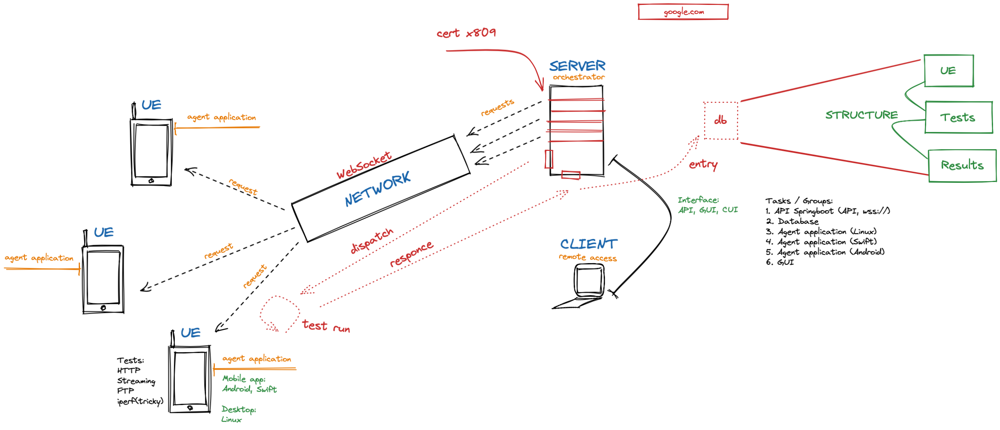

# Test processing cycle

## Visualization

## Connection

### Authorization

JWT?

### websocket

 - dial predetermined IP of the server

### message

 - client info
 - availability

## Server response

### message

 - script

## Processing

 - allocate threads
 - execute tasks
 - receive test results
   + time benchmarks
   + booleans (pass/fail)

## Issueing response to the server

### message

 - test results
   + pass/fail
   + execution times

## Disconnecting

### message

 - client info
 - disconnect info
